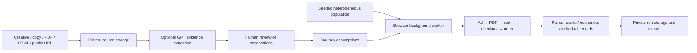

# Bureau Obscura · Consumer Analysis Division

A purchase-journey simulator for comparing advertising, product-page, offer, and checkout decisions. It evaluates up to **10,000,000 individual synthetic consumers** against as many as eight journeys, using persistent preferences and the same random streams in each comparison.

The application is an assumption-driven decision tool. Its default population and behavioral coefficients are **not empirically validated consumer research**. A large synthetic population reduces simulation noise; it does not establish real-world demand.

## Complete example: Brightbank soda

The [Brightbank example study](public/examples/brightbank/README.md) includes a finished fictional Instagram ad, product pages, a PDF product sheet, interactive cart/checkout mockups, eight journeys evaluated across 10 million synthetic consumers, six price points, and replayable results. [Read the findings](public/examples/brightbank/RESULTS.md) or open **Model record → Open completed example** in the app.

Run `npm run example:brightbank` to reproduce the calculations. The package includes [manual input rationale](public/examples/brightbank/assumptions.md), [source hashes](public/examples/brightbank/evidence-manifest.json), and a [browser test record](public/examples/brightbank/browser-test.md).

## What it does

- **Ad inputs:** Instagram, Facebook, TikTok, or Google Search; creative evidence; headline; body copy or transcript; CTA; search query and commercial intent; visible price; prior-exposure context; CPM.
- **Page inputs:** product title, category, positioning, full PDP copy, price, stock, return window, mobile usability, load-time assumption, ad-to-page consistency, product answers, reassurance, and supporting evidence.
- **Evidence:** image, PDF, HTML, and text uploads; pasted copy; public URL import through Jina Reader. Optional GPT-5.6 Terra analysis returns observations for human review before they affect the simulation.
- **Offer economics:** shipping, disclosure timing, free-shipping threshold, tax, automatic discounts, promo-code discovery, delivery estimate, unit cost, fulfillment cost, and configurable payment fees.
- **Checkout:** guest accounts, wallets, PayPal, BNPL, and up to 12 ordered steps with required fields, waiting, clarity, and technical-failure assumptions.
- **Population:** structural category disinterest, active versus dormant need, online-purchase willingness, fixed personal budgets, familiarity, device, research tendency, and price sensitivity. Individual traits also include urgency, patience, privacy, deal seeking, and competing-product satisfaction.
- **Experiments:** editable alternatives, price-only sweeps, paired buyer gains and losses, price and contribution curves, and population sensitivity checks.
- **Results:** nested funnel counts, conditional rates, stage-specific modeled barriers, information and coupon detours, checkout-step completion, segments, revenue, contribution, and deterministic individual records.
- **Research controls:** historical baseline fitting, impossible-target rejection, calibration-change detection, frozen run inputs, reproducible seeds and ID ranges, JSON/CSV/report export, and private saved studies.

## Architecture



The worker generates profiles on demand rather than keeping ten million large JavaScript objects in memory. Every ID is evaluated directly. A 200,000-person sample is used only for explicitly labeled calibration and sensitivity work.

The simulation engine is independent of React, storage, and paid providers. See [`lib/sim/engine.ts`](lib/sim/engine.ts), [`lib/sim/random.ts`](lib/sim/random.ts), and the [model card](public/model-card.md).

The server uses Cloudflare D1 for ownership and metadata, R2 for uploaded binary evidence and frozen runs, and the Sites authentication dispatcher. Provider keys are held in the browser tab's memory and forwarded for explicit analysis requests only. They are not stored in D1, R2, localStorage, exports, or logs.

## Run locally

Requires Node.js 22.13 or newer. Node 24 is used by the API integration test's `node:sqlite` fixture setup.

```sh
git clone https://github.com/BureauObscura/bureau-consumer-analysis.git
cd bureau-consumer-analysis
npm ci
npm run build
node --import ./scripts/sites-env.mjs ./node_modules/wrangler/bin/wrangler.js d1 execute DB --local --config dist/server/wrangler.json --persist-to .wrangler/state --file drizzle/0000_cute_sleepwalker.sql
npm run dev
```

Open the printed local URL (default port 5174). Use **Connections → Sign in with ChatGPT** for the starter's loopback-only development identity. Run each database migration once. Local SQLite and R2 data live under ignored `.wrangler/` state.

For an already initialized checkout, use `npm run dev`. The worker bundle is generated by `predev` and `prebuild`. After changing worker or engine source during a running dev session, run `npm run worker:build` before starting another simulation.

The repository uses Vinext/React on Cloudflare Workers. The logical bindings in `.openai/hosting.json` are `DB` and `BUCKET`. This public repository includes logical bindings only. A separately hosted copy needs its own Sites registration and storage provisioning. Local development uses the included loopback authentication; hosted authentication depends on the Sites dispatcher. Outside Sites, provide a trusted authentication gateway that removes incoming `oai-authenticated-user-*` headers and supplies verified identity headers before exposing the storage API.

## Use the app

1. Edit the product and choose a platform in **Journey inputs**.
2. Add the actual creative and complete page evidence under each stage's **Sources** tab. Use PDF or screenshots when visual layout matters; HTML and public-URL imports provide inert text and form labels.
3. Set inputs manually, or add your own OpenAI API key and explicitly request a source analysis. Review individual observations before applying them. Source upload alone does not alter the model.
4. Configure category relevance, budget, and audience assumptions in **Population**.
5. Duplicate the journey, add a preset, or configure a price-only sweep in **Experiments**.
6. Run the population. Compare purchases per exposed consumer and contribution after media, then inspect the people gained or lost.
7. Save the study and frozen run. Export the JSON alongside the report when sharing research internally.
8. Calibrate to comparable observed funnel counts, stress-test assumptions, and validate the preferred intervention with real experiments.

A source-analysis action sends one selected source plus the product/copy context to OpenAI and may incur a charge. There are no automatic paid retries. **Recover saved analysis** reads existing completed results without calling the provider. A new analysis is a new paid request.

Public page import sends the selected URL to **Jina Reader**. It does not crawl a whole store, log into accounts, or submit checkout actions. Do not supply private or signed URLs. PNG/JPEG/WebP/PDF uploads are limited to 8 MB each; HTML input is limited to 2 million characters and extracted text to 50,000 characters. Motion ads require supplied storyboards/key frames and a transcript; this version does not analyze video playback or audio directly.

## Verification

```sh
npm run typecheck
npm run lint
npm test
node scripts/test-worker.mjs
node scripts/api-smoke.mjs http://localhost:5174
node scripts/benchmark.mjs 10000000
```

The API smoke test requires the local development server and initialized database. It uses the supported local sign-in cookie and synthetic foreign-owner fixtures. It is restricted to loopback and makes no paid provider calls.

Regression tests cover Philox known-answer vectors, structural purchase exclusions, sequential selection, identical alternatives, partition reproducibility, exact consumer replay, monetary rounding, impossible calibration, invalid artifacts, signed/local URL rejection, and inert HTML extraction. The built-worker test verifies a real one-million-consumer run and compact progress messages. API tests exercise source and study ownership, byte-preserving uploads, canonical evidence, provenance checks, and concurrent duplicate saves.

See [validation record](docs/VALIDATION.md) for what was exercised and what was not. See [product decisions](docs/PRODUCT-DECISIONS.md) for the marketing and technical reasoning behind the design.

## Scope

One product unit, one modeled impression, and a single-session online journey. CPM covers only that modeled impression. Prior exposure changes fatigue without adding historical media spend. Tax is a configured scenario assumption, not a tax calculation service. Contribution excludes overhead, returns, repeat purchases, and lifetime value.

Default platform differences, distributions, correlations, price response, and friction coefficients are authored hypotheses. Source extraction is not usability testing. A model-derived reason is not an interview quote or causal proof. Monte Carlo intervals describe random variation inside the model, not uncertainty about actual consumers.

## Attribution

Philox follows Random123; its license and attribution are in [`docs/RANDOM123-LICENSE.txt`](docs/RANDOM123-LICENSE.txt). IBM Plex Mono and EB Garamond include their SIL Open Font Licenses under `public/bureau/fonts`. The Sites adapter and shadcn/Tailwind registry assets retain their provided notices. Bureau Obscura branding is used for this portfolio application.
